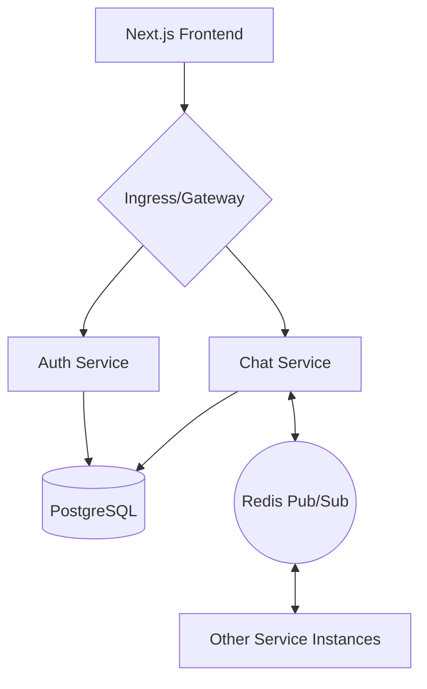

# 🚀 Nexus – Real-Time Chat Architecture

[](https://github.com/SaimaLearnathon/Selise-ChatApp/actions/workflows/test.yml)
[](https://nodejs.org/)
[](https://nextjs.org/)
[](https://socket.io/)
[](https://prisma.io/)

Nexus is a professional-grade, microservices-based chat application designed with scalability and high availability in mind. It demonstrates modern architectural patterns including **Event-Driven Microservices**, **Redis-based Scaling**, and **Automated CI/CD with Docker**.

---

## ✨ Key Features

- **Real-Time Communication**: Seamless messaging with Socket.IO & Redis Pub/Sub for horizontal scaling.
- **Microservices Architecture**: Decoupled Auth and Chat services for independent scalability.
- **Security & Rate Limiting**: Multi-layered protection using JWT and Redis-backed rate limiters to prevent brute-force attacks.
- **Modern UI**: High-performance, responsive interface built with Next.js App Router, TailwindCSS, and Zustand.
- **Relational Integrity**: Prisma ORM for robust database schema management and type safety.
- **DevOps Ready**: Fully containerized with Docker, automated CI pipelines with GitHub Actions, and deployment scripts for Azure.

---

## 🏗️ Technical Architecture



---

## 📂 Project Structure

```bash
Selise-Project/
├── frontend/             # Next.js App Router client
├── services/
│   ├── auth-services/    # JWT Auth & User Management (Node/Express)
│   └── chat-services/    # Real-time Messaging (Node/Socket.io)
├── .github/workflows/    # CI/CD Automated Pipelines
├── docker-compose.yml    # Local Orchestration
└── deploy-azure.ps1      # Azure Deployment Script
```

---

## 🛠️ Local Development

### Prerequisites
- **Docker & Docker Compose** (Recommended)
- Node.js 20.x
- Redis

### Setup (Docker - Fastest)
```bash
# Clone the repository
git clone https://github.com/SaimaLearnathon/Selise-ChatApp.git
cd Selise-ChatApp

# Run with Docker Compose
docker-compose up --build
```
The app will be available at `http://localhost:3000`.

### Setup (Manual)
Each service requires its own dependencies:
```bash
# Frontend
cd frontend && npm install && npm run dev

# Services
cd services/auth-services && npm install && npm start
cd services/chat-services && npm install && npm start
```

---

## 🧪 Testing

We use **Jest** and **Supertest** for comprehensive API integration and unit testing.

```bash
# Run tests for a specific service
cd services/auth-services
npm test

# Run tests with verbose output
npx jest --verbose
```

---

## 🛡️ Security Implementation

- **JWT Authentication**: Secure stateless authentication across services.
- **Rate Limiting**: Implementation of `express-rate-limit` with `rate-limit-redis`.
    - `Global Limiter`: Protects all routes from general DoS.
    - `Auth Limiter`: Prevents brute-force on `/login` and `/register`.
- **Secret Management**: Purged from Git history and managed via environment variables.

---

## ☁️ Deployment

### Azure Kubernetes Service (AKS)
1. Ensure `az cli` is installed and logged in.
2. Run the deployment script:
   ```powershell
   ./deploy-azure.ps1
   ```
3. Alternatively, use the manifests in the `k8s/` folder:
   ```bash
   kubectl apply -f k8s/
   ```

---

## 👤 Author

**Farhana Islam Saima**  
Full Stack Developer | Specializing in DevOps & Microservices

---

## 📄 License
This project is licensed under the MIT License - see the LICENSE file for details.
